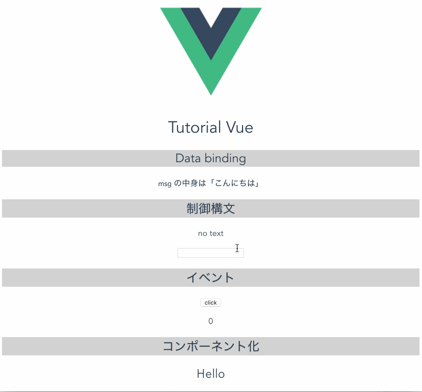

### Vue 勉強中... (shinjuku-mokumoku #15)

---

#### やったこと

- Vue の環境構築
docker に `npm`, `vue-cli` 入れて init しただけ。
    
- ドキュメント読んで基本作法をみた
  - データバインディング
  - 制御構文
  - コンポーネント化
  - ...

- 基本作法を書いてみた

---

---

#### 感想

ちょっとしかさわってないので、まだメリットはわからないですね。  
Modelの定義とかが綺麗にできるのかな？という感じ。

#### 課題

`vue-router`使ってSPAで試したけど、SSRのところさわっておきたい。
